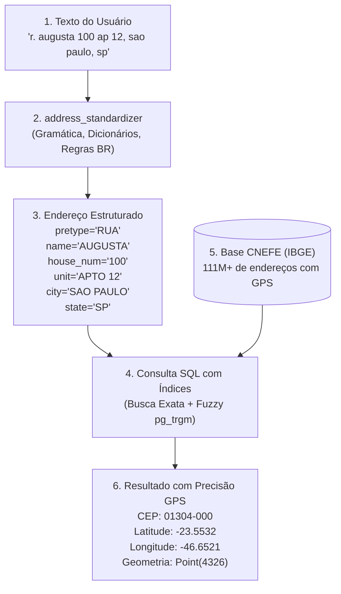

# Guia Completo: Geocodificador Brasileiro com PostGIS e IBGE CNEFE

Este guia explica como integrar a extensão **`address_standardizer` (PostGIS)** com a base de dados aberta **CNEFE 2022 (IBGE)** para construir um **Geocodificador Brasileiro 100% Gratuito e Offline** (busca de CEPs, validação de logradouros e obtenção de coordenadas GPS Latitude/Longitude).

---

## 1. Entendendo a Arquitetura (Parser vs Base de Dados)

O sistema de geocodificação é dividido em duas etapas complementares:



* **`address_standardizer` (Etapa 1):** O motor gramatical leve (~1 MB). Ele não armazena todas as ruas do país, mas sabe como o brasileiro escreve endereços e desmembra o texto livre em colunas consistentes.
* **CNEFE do IBGE (Etapa 2):** A base física de referência (~15 a 30 GB no PostgreSQL com 111+ milhões de pontos). Armazena cada coordenada geográfica real do Censo 2022.

---

## 2. Estrutura da Tabela de Geocodificação no PostGIS

Crie a tabela com suporte espacial nativo do PostGIS e índices de alto desempenho:

```sql
-- 1. Habilitar extensões necessárias
CREATE EXTENSION IF NOT EXISTS postgis;
CREATE EXTENSION IF NOT EXISTS pg_trgm;
CREATE EXTENSION IF NOT EXISTS address_standardizer;
CREATE EXTENSION IF NOT EXISTS address_standardizer_data_br;

-- 2. Tabela de referência de endereços (CNEFE / IBGE)
CREATE TABLE IF NOT EXISTS cnefe_enderecos (
    id bigserial PRIMARY KEY,
    cod_municipio_ibge integer NOT NULL,
    municipio text NOT NULL,
    uf varchar(2) NOT NULL,
    tipo text,              -- RUA, AVENIDA, etc.
    logradouro text NOT NULL, -- AUGUSTA, PAULISTA, etc.
    numero text,            -- 100, 1000, S/N
    complemento text,       -- APTO 12, BLOCO B
    bairro text,            -- BELA VISTA, CENTRO
    cep varchar(9),         -- 01304-000 ou 01304000
    latitude double precision,
    longitude double precision,
    geom geometry(Point, 4326) -- Coordenada WGS 84
);

-- 3. Índices de busca rápida (B-tree e Espacial GiST)
CREATE INDEX IF NOT EXISTS idx_cnefe_lookup 
    ON cnefe_enderecos (uf, municipio, logradouro, numero);

CREATE INDEX IF NOT EXISTS idx_cnefe_cep 
    ON cnefe_enderecos (cep);

CREATE INDEX IF NOT EXISTS idx_cnefe_geom 
    ON cnefe_enderecos USING GIST (geom);

-- 4. Índice para busca fonética / tolerância a erros de digitação (Fuzzy Search)
CREATE INDEX IF NOT EXISTS idx_cnefe_logr_trgm 
    ON cnefe_enderecos USING GIN (logradouro gin_trgm_ops);
```

---

## 3. Consultas de Geocodificação (Como Cruzar os Dados)

### Consulta 1: Geocodificação Exata (Endereço Completo)

Recebendo uma string livre do usuário (ex: formulário de checkout ou entrega):

```sql
WITH parsed AS (
    SELECT * FROM standardize_address(
        'br_lex', 'br_gaz', 'br_rules',
        'Rua Augusta, 100 Apto 42',
        'Sao Paulo, SP'
    )
)
SELECT 
    c.id,
    c.tipo,
    c.logradouro,
    c.numero,
    c.bairro,
    c.municipio,
    c.uf,
    c.cep,
    c.latitude,
    c.longitude,
    ST_AsGeoJSON(c.geom) AS geojson
FROM cnefe_enderecos c, parsed p
WHERE c.uf = p.state
  AND c.municipio = p.city
  AND c.logradouro = p.name
  AND c.numero = p.house_num
LIMIT 1;
```

---

### Consulta 2: Geocodificação com Tolerância a Erros (Fuzzy Matching via `pg_trgm`)

Se o usuário cometer erros de digitação (ex: *"Rua Agusta"* em vez de *"Augusta"*):

```sql
WITH parsed AS (
    SELECT * FROM standardize_address(
        'br_lex', 'br_gaz', 'br_rules',
        'Rua Agusta 100',
        'Sao Paulo, SP'
    )
)
SELECT 
    c.id,
    c.tipo,
    c.logradouro,
    c.numero,
    c.cep,
    c.latitude,
    c.longitude,
    similarity(c.logradouro, p.name) AS score_similaridade
FROM cnefe_enderecos c, parsed p
WHERE c.uf = p.state
  AND c.municipio = p.city
  AND c.numero = p.house_num
  AND c.logradouro % p.name -- Operador de similaridade de trigramas
ORDER BY score_similaridade DESC
LIMIT 5;
```

---

### Consulta 3: Busca Reversa (Coordenada GPS $\rightarrow$ Endereço Padronizado)

Encontrar o endereço e CEP mais próximos de um ponto no mapa (ex: GPS do motorista):

```sql
SELECT 
    c.tipo || ' ' || c.logradouro || ', ' || c.numero AS endereco,
    c.bairro,
    c.municipio,
    c.uf,
    c.cep,
    ST_Distance(c.geom::geography, ST_SetSRID(ST_Point(-46.6521, -23.5532), 4326)::geography) AS distancia_metros
FROM cnefe_enderecos c
ORDER BY c.geom <-> ST_SetSRID(ST_Point(-46.6521, -23.5532), 4326) -- Busca ultra-rápida por KNN GiST
LIMIT 1;
```

---

## 4. Onde Baixar a Base Aberta do IBGE (CNEFE)

O IBGE disponibiliza os arquivos de todos os estados do Brasil publicamente e sem custo:
* **Portal de Geociências do IBGE:** [CNEFE - Censo Demográfico 2022](https://www.ibge.gov.br/geociencias/organizacao-do-territorio/estrutura-territorial/27533-cadastro-nacional-de-enderecos-para-fins-estatisticos.html)
* **FTP Público:** `ftp://geoftp.ibge.gov.br/organizacao_do_territorio/estrutura_territorial/cadastro_nacional_de_enderecos_para_fins_estatisticos/censo2022/`

Você pode utilizar o script [`tools/import_cnefe.py`](../tools/import_cnefe.py) para baixar e importar automaticamente os dados do estado desejado diretamente no PostGIS.
